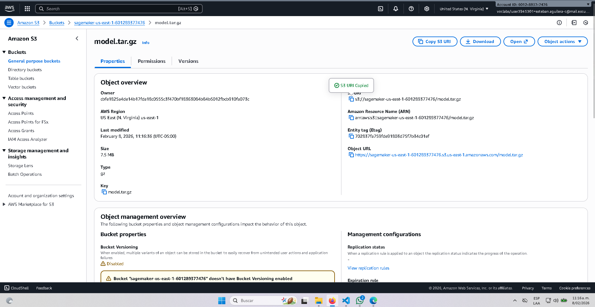
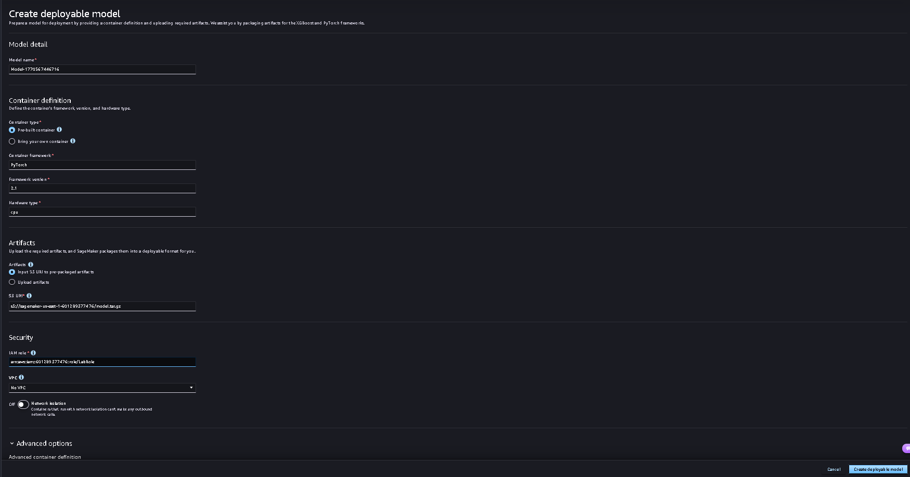
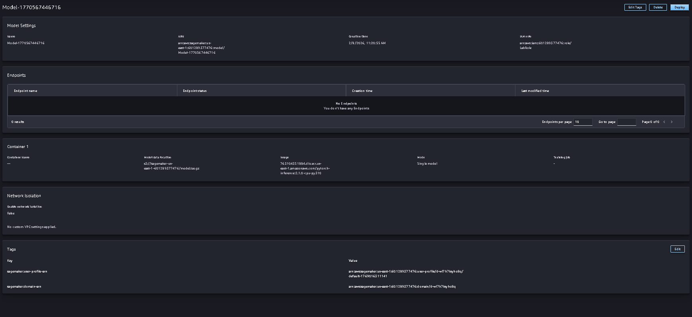

# English Premier League Logo Detection (20K) – EDA + Modelos

## Descripción del problema

Clasificación de logos de equipos de la Premier League a partir de imágenes. El objetivo es comparar un **baseline denso** vs una **CNN** y justificar decisiones arquitectónicas con una EDA breve.

---

## Introducción

Este notebook documenta una EDA breve del dataset *English Premier League Logo Detection (20K images)*. La idea es entender cómo está organizado, cómo se distribuyen las clases y qué decisiones de preprocesamiento son necesarias antes de entrenar una CNN.

Me enfoqué en:
- Verificar la estructura de carpetas y el CSV de etiquetas.
- Medir distribución de clases y detectar desbalance.
- Revisar tamaños y canales de imagen.
- Mostrar ejemplos por clase.
- Dejar recomendaciones claras de preprocesamiento.

---

## Dataset

**Kaggle – English Premier League Logo Detection (20K images)**  
Dataset: `alexteboul/english-premier-league-logo-detection-20k-images`

- **Total de imágenes:** 20,000
- **Etiquetas:** `team_name` (string), `team` (id numérico)
- **CSV:** `train.csv` con `filepath` (ruta estilo Kaggle). En el notebook se resuelve a rutas locales con `local_path`.

---

## Qué hay en el notebook

### eda_dataset_exploration.ipynb

- **1.2 – Inspección del dataset**: estructura de carpetas, búsqueda recursiva de imágenes y ubicación del CSV.
- **1.3 – Distribución de clases**: comparación Top/Bottom por número de imágenes.
- **1.4 – Dimensiones y canales**: muestreo de tamaños y modos (`RGB`, `RGBA`, etc.) con histogramas.
- **1.5 – Ejemplos por clase**: grilla de muestras para validar coherencia visual.
- **1.6 – Preprocesamiento**: RGB, resize, normalización y augmentations suaves.
- **1.7 – Conclusiones**: síntesis de hallazgos y próximos pasos.
- **2 – Baseline (sin convolución)**: modelo denso con métricas train/val.
- **3 – CNN (diseño y justificación)**: decisiones de arquitectura y parámetros.
- **4 – Experimentos controlados**: comparación de kernels 3×3 vs 5×5.
- **5 – Interpretación**: sesgos inductivos y cuándo usar/no usar convoluciones.

---

## Diagrama de arquitectura (simple)

**Baseline (denso)**

```
Imagen 96x96x3
  ↓ Flatten
Dense(128) → ReLU
  ↓
Dense(C)
```

**CNN propuesta**

```
Input 64x64x3
→ Conv(32, 3x3) + ReLU + MaxPool(2)
→ Conv(64, 3x3) + ReLU + MaxPool(2)
→ Flatten → Dense(128) + ReLU → Dropout(0.3)
→ Dense(C)
```

---

## Resultados experimentales (resumen)

Estos resultados se generan al ejecutar el notebook:

| Experimento | Train acc | Val acc | Train loss | Val loss | Parámetros |
|---|---:|---:|---:|---:|---:|
| Baseline (MLP) | 0.941 | 0.868 | 0.362 | 0.628 | 3,541,652 |
| CNN (3×3) | 0.918 | 0.888 | 0.3346 | 0.4040 | 2,119,252 |
| CNN (5×5) | 0.890 | 0.863 | 0.3653 | 0.4252 | 2,153,556 |

---

## Interpretación

La CNN suele rendir mejor que el baseline porque explota **localidad** y **compartición de pesos**, reduciendo parámetros y mejorando generalización. Si no supera al baseline, suele deberse a entrenamiento corto, preprocesamiento débil o muestra pequeña.

---

## 6. Entrenamiento, exportación y despliegue (SageMaker)

En esta sección se documenta el flujo de exportación del modelo y el intento de despliegue en SageMaker. En AWS Academy no se puede crear el endpoint por restricciones de permisos, pero el artefacto `model.tar.gz` se generó correctamente y se subió a S3.

**Evidencias del proceso (capturas):**

**Subida del `model.tar.gz` a S3**

Captura de la carga del artefacto `model.tar.gz` al bucket S3. Esto valida que el paquete del modelo quedó disponible para SageMaker.



**Creación del modelo en SageMaker (configuración)**

Formulario de creación del modelo en SageMaker, indicando el nombre, framework (PyTorch) y la ruta del artefacto en S3.



**Modelo creado exitosamente**

Pantalla de confirmación donde se visualiza el modelo registrado correctamente en SageMaker.



**Error al intentar crear el endpoint por política explícita**

Intento de despliegue del endpoint fallido por una denegación explícita en la política IAM del laboratorio de AWS Academy.


---

## Conclusiones

- Se completó el flujo local de entrenamiento, exportación y prueba; el modelo responde con una predicción válida y probabilidad alta.
- El artefacto `model.tar.gz` es compatible con SageMaker y se pudo subir a S3.
- La creación del endpoint falló por **restricciones de la política IAM** en AWS Academy (denegación explícita a `sagemaker:CreateEndpointConfig`).
- Con permisos adecuados, el despliegue debería completarse sin cambios adicionales en el artefacto.

---

## Requisitos

- Python 3.10+
- Librerías:
  - `pandas`
  - `numpy`
  - `matplotlib`
  - `Pillow`
  - `kagglehub`
  - `scikit-learn`
  - `torch`
  - `torchvision`

---

## Información del Proyecto

- **Autor**: Esteban Aguilera Contreras
- **Universidad**: Escuela Colombiana de Ingeniería Julio Garavito
- **Asignatura**: Arquitecturas Empresariales (AREP)